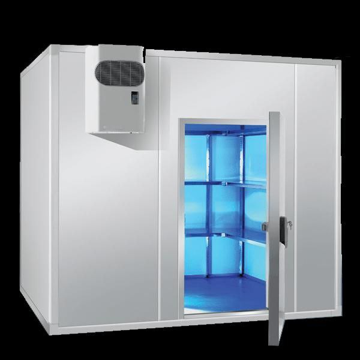

# Bem-vindos ao Projeto Chapa Fria

Projeto para Câmara Frigorífica para a Empresa FriCoelho, para acondicionamento de carnes, localizada no bairro do Indiano, município de Garanhuns/PE.

---
!!! info "Informação relevante"
    Projeto (como atividade escolar) desenvolvido na disciplina de Gestão de Projetos, do Curso de Engenharia Elétrica, do Instituto Federal de Pernambuco, _Campus_ Garanhuns, sob orientação do Prof. Dr. Márcio Severino da Silva.
