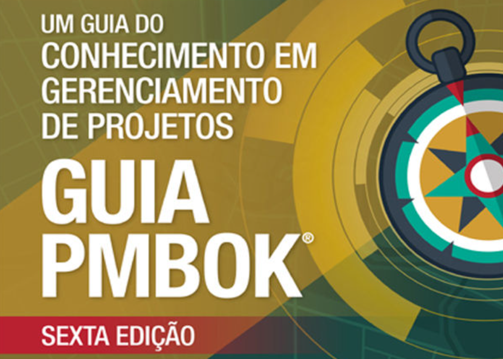
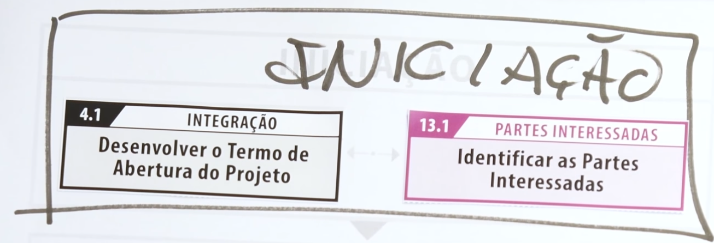

# Introdução à Gestão de Projetos

Inicialmente, precisaremos compreender sobre o que é um projeto e seus elementos.

Destacamos especial atenção para algumas definições, baseados no PMBoK&reg; Guide, 6a Ed. PMI.

## Projeto

Projeto é um esforço temporário empreendido para criar um produto, serviço ou resultado exclusivo.

## Projetos vs. Operações

Entendimentos semelhantes: 

- realizado por pessoas;
- limitado aos recursos disponíveis;
- planejados;
- executados; e,
- controlados.

Entendimentos diferentes:

Operações:

- Definidos e utilizados frequentemente;
- Contínuas;
- Repetitivas;
- Mantém o negócio.

Projetos:
- Construção progressiva;
- Temporários;
- Únicos;
- Alcançam seu objetivo e, logo em seguida, terminam.

Características de um projeto (Planejado, executado e controlado):
- Feito por pessoas;
- Tem início e fim;
- Cria um resultado único;
- Elaborado progressivamente;
- Possui um custo;
- Sofre restrições de recursos limitados;
- Corre riscos para alcançar o sucesso;
- Pode adquirir produtos ou contratar serviços.

## Gerente de Projetos

Responsabilidades:

- O gerente de projetos é, acima de tudo, um líder.
- Se comunicar muito bem.
- Mantem-se em constante aprendizagem
- Tem um lado negociador
- Abraça as mudanças como algo natural
- É um excelente gestor de processos
- Sabe avaliar riscos
- Mantem o foco nos resultados

## Iniciação 

A primeira coisa que faremos será recorrer ao **Processo de Iniciação**, para começarmos a dar 'vida' ao projeto, seguindo para o tópico:

### Termo de Abertura do Projeto

**4.1 Desenvolver o Termo de Abertura do Projeto**
 
É um documento simples, objetivo, de uma ou duas páginas, que basicamente nos diz o que será realizado e como se dará essa realização.

Há vários modelos disponíveis na Internet, para a construção desse projeto, nos utilizaremos das definições disponibilizadas por Ricardo Vargas, disponíveis em seu site:

- [Termo de Abertura e Declaração de Escopo](https://ricardo-vargas.com/pt/downloads/project-charter-and-scope-statement-content-and-d-65/) by Ricardo Vargas.

Em seguida, vamos recorrer ao tópico:

### Partes Interessadas

**13.1 Identificar as Partes Interessadas**, ou seja, quem são os intervenientes, ou seja, com quem vamos precisar nos relacionar ou nos comunicar, dentro do projeto, quem será o:

- Cliente;
    - Patrocinador(es);
- Fornecedores;
- Entidades Governamentais;
- Competidores
- ...

## Referências

- PMI. PMBoK Guide. $6^{\text{th}}$ Edition. 2020.
- Vargas, R. Explicando o PMBoK. Disponível em: [https://ricardo-vargas.com/](https://ricardo-vargas.com/). Acesso em: 7 Set. 2021.
- Pacheco, V. Gestão de Projetos. Disponível em: [https://gist.github.com/sftom/9c5e420c9919d2707c8f98713d4e50fa](https://gist.github.com/sftom/9c5e420c9919d2707c8f98713d4e50fa)

